# Titan

**Dein NAS. Deine Dateien. Dein Desktop.**

Titan ist ein eigenständiges NAS-System auf Debian für AMD64. Die Weboberfläche verbindet einen persönlichen Desktop mit Dateimanager, Speicherverwaltung, Freigaben, Docker-Compose-Apps, virtuellen Maschinen und signierten Systemupdates.

**Version 0.6.1 · Entwicklungsstand.** Zunächst in einer separaten VM und mit Testdaten verwenden.

[**Installationsimage herunterladen (.img.xz)**](https://github.com/ra5on/Titan/releases/download/v0.6.1/titan-0.6.1-amd64.img.xz) · [Release, signiertes Update und Prüfberichte](https://github.com/ra5on/Titan/releases/tag/v0.6.1) · [Änderungen in 0.6.1](docs/RELEASE-0.6.1.md)

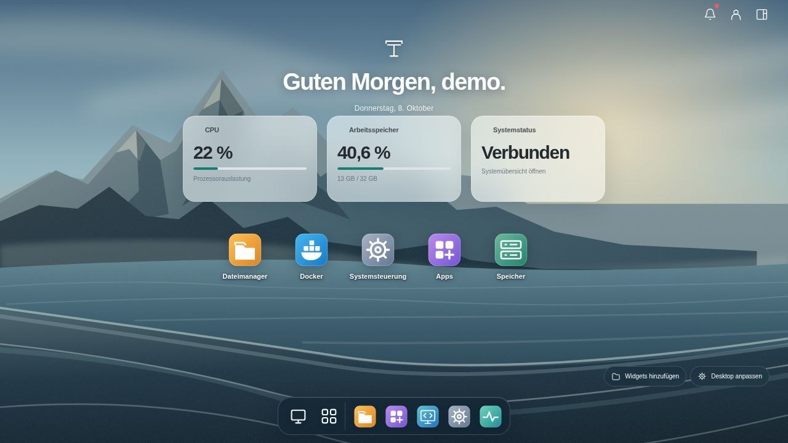

*Die Screenshots zeigen die Carbon-Oberfläche von 0.6.0 mit Beispieldaten. Die Demo führt keine Installationen oder Änderungen am echten NAS aus.*

> Separates Webupdate: **0.6.2** verbessert Desktopstart, Fensterladezeiten und die Fehlerbehandlung im Dateimanager. [Änderungen](docs/RELEASE-0.6.2.md) · [Veröffentlichtes Webupdate](https://github.com/ra5on/Titan/releases/tag/web-v0.6.2). Die Neuinstallationsbasis bleibt **0.6.1**.

## Verfeinerte Oberfläche

Die Anmeldung zeigt den unveränderten Titan-Schriftzug über einer kleinen transparenten Fläche. Das Hauptmenü trennt Dateien & Apps, System und Verwaltung; die Suche blendet leere Gruppen aus. Helle Arbeitsflächen, matte App-Karten und weniger sichtbare Carbon-Struktur geben Texten und Daten mehr Ruhe. VM-Details zeigen die Live-Werte ohne doppelte CPU-/RAM-Karten und bieten „Konsole öffnen“ direkt an.

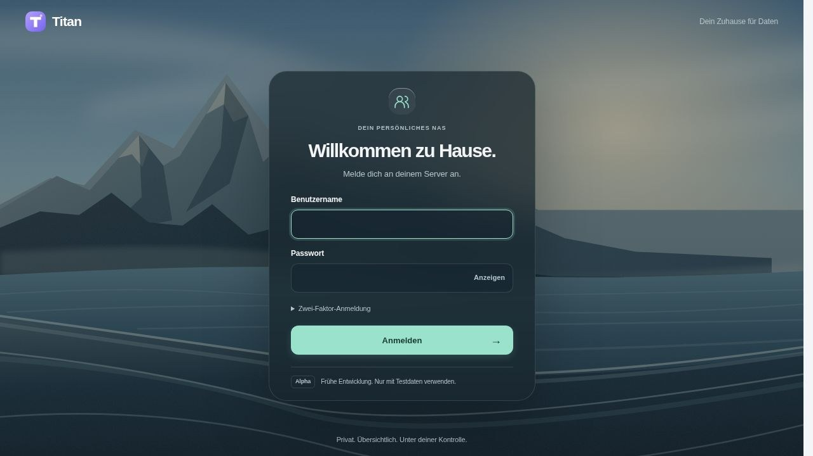

## Neue Installationsbasis 0.6.1

Für diese Version ist eine Neuinstallation vorgesehen. Die Weboberfläche läuft als vorinstallierter Docker-Container und lässt sich künftig unabhängig vom Betriebssystem aktualisieren. Daten und Einstellungen bleiben außerhalb des Containers. [Container und Updates](docs/WEB-CONTAINER.md) · [Änderungen](docs/RELEASE-0.6.1.md).

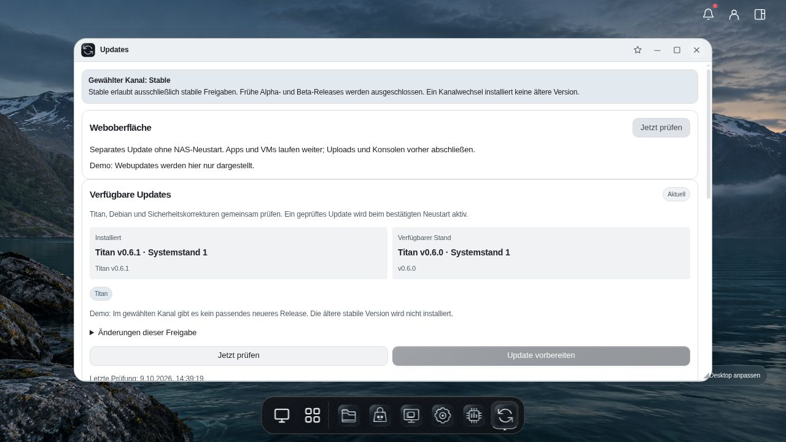

*Updateansicht von 0.6.1 mit ausdrücklich gekennzeichneten Demodaten. Webupdates und Systemupdates haben getrennte Bedienelemente.*

## Installieren und öffnen

Für eine neue Test-VM: **UEFI/OVMF, Secure Boot aus, 8 GiB RAM, mindestens 2 CPUs und 64 GiB virtuelle Festplatte**. Das entpackte Rohimage ist 48 GiB groß. Die virtuelle Platte vor dem ersten Start auf die gewünschte Kapazität erweitern; Titan vergrößert seinen Datenbereich beim Start. Für VMs innerhalb von Titan muss der Host verschachtelte Virtualisierung erlauben.

1. Die `.img.xz` aus dem Release herunterladen und die mitgelieferte Prüfsumme prüfen.
2. Entpacken und das `.img` als Systemplatte importieren oder auf den vorgesehenen Datenträger schreiben. **Das Schreiben überschreibt das Ziel.**
3. Titan starten und im eigenen Netz `https://<NAS-IP>` öffnen.
4. Den Administrator selbst einrichten. Es gibt kein vorgegebenes Kennwort.

Neuinstallationen verwenden **HTTPS auf Port 443**; HTTP auf Port 80 leitet dorthin weiter. Das lokale Zertifikat ist selbstsigniert. Bestehende Installationen behalten bei einem Update ihre bisherigen Webports. Unter **Einstellungen → Allgemein → Webzugriff** können Protokoll und Ports geändert werden. Die neue Adresse muss innerhalb von **120 Sekunden** bestätigt werden; sonst stellt Titan die bisherige Einstellung wieder her.

[Installationsanleitung](docs/INSTALL.md) · [Image, Partitionen und Proxmox](docs/TITAN-IMAGE.md)

## Persönlicher Desktop

Ein eigener Landschaftshintergrund, eine persönliche Begrüßung, frei platzierbare Apps und transparente Live-Widgets bilden den Desktop. Das kompakte Dock hält die Werkzeuge erreichbar. Jedes Konto erhält eigene Verknüpfungen, Widgetpositionen und Darstellungsoptionen. Fenster lassen sich öffnen, verschieben, verkleinern und minimieren. Die Seitenleisten in Dateimanager, VM-Verwaltung, Docker, Speicher und Einstellungen können am Trenner breiter oder schmaler gezogen werden.

Die neue Hintergrundoption **Fjord** wurde eigens für Titan mit Imagegen erzeugt. Vorhandene Hintergrundauswahlen bleiben erhalten. Herkunft und Generierungsprompt stehen bei den [Hintergründen](titan/web/wallpapers/README.md).

Das kantige Titan-Symbol und der TITAN-Schriftzug bestimmen die Gestaltung: 18 eigene schwarze Carbon-Symbole für Titan-Werkzeuge und Container, Graphit- und Silberflächen, feine Lichtkanten und ein heller Platinmodus. Dock, Widgets, Fenster, App Store, Dateimanager, Einstellungen und Titan-Kopfzeilen folgen derselben Formsprache. Fremde App-Symbole erscheinen über CSS in Graustufen; ihre Originaldateien bleiben unverändert. Warnungen und Fehler behalten ihre erkennbaren Zustandsfarben. [Dateien, Herkunft und Entwurf](docs/branding/README.md) sind separat dokumentiert.

Öffnen, Minimieren, Wiederherstellen und Maximieren verwenden zusammenhängende Fensterübergänge. Bei reduzierter Bewegung entfallen die Animationen. Live-Messwerte lösen keine neue Einblendanimation aus. Beim Schließen ändern sich Dock und gespeicherter Zustand sofort; die Bedienung wartet nicht auf eine Hintergrundanimation.

Im Kontomenü stehen **Hell, Dunkel und Automatisch** sowie ein globaler Transparenzregler für den eigenen Desktop bereit. Automatisch folgt dem Betriebssystem. Bereits geöffnete Titan-Fenster und eingebettete Konsolen wechseln mit; eigenständige VM-Konsolentabs laden die gespeicherte Darstellung beim Öffnen. Für einen Klick auf freien Desktop lässt sich auswählen, ob die Fenster minimiert werden oder nichts geschieht. Optional blendet sich das Dock bei maximierten Fenstern aus; „Dock anzeigen“ holt es per Maus, Tastatur oder Touch zurück. Auf schmalen Bildschirmen bleibt es sichtbar.

Über **Widgets hinzufügen** öffnet sich eine Galerie für Uhr, CPU, RAM, Systemstatus, Meldungen und Aktivität. Die Karten lassen sich einzeln platzieren. Regelmäßige Messwertupdates ändern die Werte innerhalb der bestehenden Karten; die Widgets werden dabei nicht neu aufgebaut. Systemmesswerte bleiben Administratoren vorbehalten.

Rechtsklick, längeres Drücken oder **Umschalt+F10** öffnen passende Schnellaktionen. Auf Desktop und im Hauptmenü können Verknüpfungen hinzugefügt oder entfernt und Appaktionen geöffnet werden. Innerhalb von Anwendungen greifen die Menüs auf die jeweiligen vorhandenen Aktionen zu. Das Entfernen einer Desktop-Verknüpfung deinstalliert keine App. Bestätigungen zeigen die positive Aktion links und **Nein/Abbrechen rechts**.

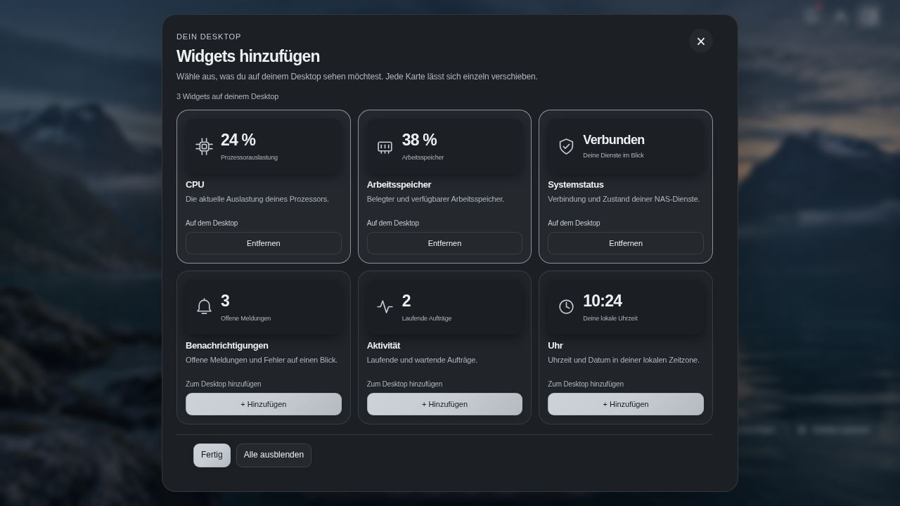

[Menüführung, Platzverteilung und Browserprüfung](docs/UI-NAVIGATION-AUDIT.md)

## Dateien verwalten

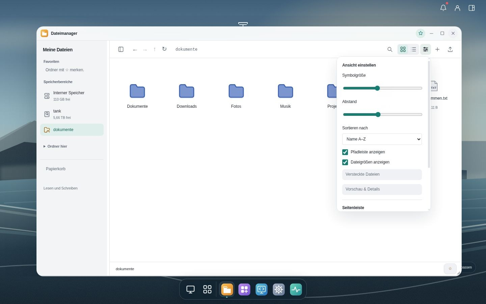

Der Dateimanager bietet Listen- und Symbolansicht, eine anpassbare Seitenleiste und eine schmale Werkzeugleiste mit Pfad, Navigation und Suche. Ein Ansichtsmenü stellt Symbolgröße, Abstände, Sortierung, versteckte Dateien, Pfadleiste und Dateigrößen ein; die Auswahl bleibt pro Konto gespeichert. Vorschau und Detailbereich öffnen bei Bedarf. Dateien und Ordner lassen sich kopieren, verschieben, umbenennen und über den Papierkorb entfernen. UTF-8-Dateien bis 1 MiB können direkt bearbeitet werden; unterstützte Bilder, Medien und Textdateien erhalten eine Vorschau.

**Mehrere Dateien können per Drag-and-drop in den geöffneten beschreibbaren Ordner geladen werden.** Der Upload zeigt Dateiname, Fortschritt und Position in der Warteschlange. „Abbrechen“ stoppt die Übertragung und die restliche Warteschlange. Bereits vollständig übertragene Dateien bleiben erhalten. Ordnerdrops werden mit einer verständlichen Meldung abgewiesen.

Neue Uploads landen zunächst in einem privaten Zwischenbereich. Erst nach vollständiger Übertragung wird die fertige Datei atomar in den Zielordner übernommen. Gleichnamige vorhandene Dateien werden nicht überschrieben. Ein abgebrochener Upload blockiert nachträglich eintreffende Teilstücke; nach einem Netzabbruch verbliebene Zwischenstände werden nach Ablauf der Aufbewahrung beim nächsten Upload bereinigt.

Datei- und Ordnermenüs bieten Aktionen passend zur Auswahl und den Zugriffsrechten. Im freien Dateibereich sind unter anderem Hochladen, Neuer Ordner, Neue Datei, Einfügen und Aktualisieren erreichbar. Administratoren können einen zeitlich begrenzten **Root-Modus** für Systemdateien aktivieren; dafür werden Passwort und gegebenenfalls der zweite Faktor erneut geprüft.

## Eigene Compose-Apps

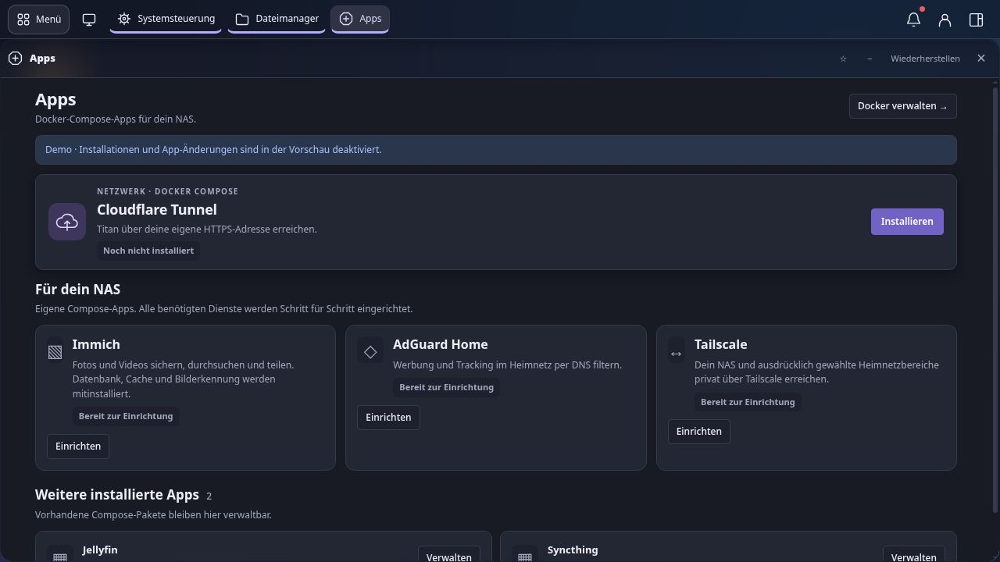

Der App Store kombiniert Suche und Kategorien mit illustrierten Empfehlungen und kompakten App-Karten. Einrichten öffnet eine eigene Detailansicht mit Konfiguration und Installationsverlauf; die Rückkehr erhält die Store-Ansicht. Der gesamte Store scrollt gemeinsam. Details beginnen oben; Zurück erhält Scrollposition und Fokus. Titan bietet lokal gepflegte Compose-Rezepte an. **BigBear und externe Store-Downloads sind entfernt.** Vorhandene, früher installierte Anwendungen behalten ihre gespeicherte Vorlage, Konfiguration und Daten und bleiben verwaltbar.

Die Einrichtung zeigt echte Schritte wie Docker prüfen, Dateien vorbereiten, Images laden, Container erstellen, starten und Bereitschaft prüfen. Der Verlauf bleibt nach einem Fensterwechsel erhalten. Fehler und unterbrochene Schritte bleiben sichtbar und lassen sich fortsetzen. Ein gestarteter Container allein wird nicht als erfolgreiche Einrichtung ausgegeben.

Der Store gleicht den Installationsstatus mit den tatsächlichen Containern ab. Wird der letzte Container einer App in der Dockeransicht entfernt, wird auch ihre Installation abgemeldet; Konfiguration und Nutzdaten bleiben erhalten. Bei außerhalb von Titan entfernten Containern zeigt die Einrichtung „Container entfernt“, erklärt den Erhalt der Konfiguration und bietet **Neu erstellen** mit den gespeicherten Einstellungen an. Gestoppte Container und teilweise vorhandene Verbünde bleiben als installiert erkennbar; ein Fehler bei der Docker-Abfrage gilt nicht als Deinstallation.

| App | Enthalten und Einrichtung |
| --- | --- |
| **Cloudflare Tunnel** | Offizieller Connector, Tunnel-Token einfügen, kein zusätzliches Verwaltungspasswort. Titan richtet das lokale Ziel ein und prüft Verbindung und optional die öffentliche HTTPS-Adresse getrennt. |
| **Immich** | Immich-Server, Machine Learning, PostgreSQL und Valkey. Speicherziel auswählen und den vollständigen Verbund installieren; das erste Immich-Konto anschließend in dessen Weboberfläche einrichten. |
| **AdGuard Home** | DNS-Filter mit eigener Webeinrichtung. DNS- und Webports werden auf Verfügbarkeit geprüft; Geräte beziehungsweise Router müssen danach AdGuard als DNS-Server verwenden. |
| **Tailscale** | Eigener Node mit Auth-Key und optionalem Subnet-Routing für ausdrücklich angegebene private Netze. Den Node und angekündigte Routen gegebenenfalls im Tailscale-Konto freigeben. |

Immich benötigt zusätzlichen Arbeitsspeicher und Platz für Originale, Vorschaubilder und Datenbank. Die Rezeptlimits des gesamten Verbunds betragen **6,25 GiB**, davon 2 GiB für PostgreSQL. Mit NAS- und Installationsreserve prüft Titan konservativ 7,75 GiB verfügbaren RAM; ein bereits ausgelasteter 8-GiB-Host kann deshalb abgewiesen werden. Für Immich zusammen mit weiteren Apps sind 16 GiB oder mehr sinnvoll.

Tailscale läuft im **Userspace-Modus** ohne privilegierten Container, Hostnetz oder Änderungen an Host-Routing und Firewall. Subnet-Routing unterstützt TCP und UDP; Ping ist eingeschränkt, andere IP-Protokolle werden nicht weitergeleitet. Das Zielnetz muss vom Container aus erreichbar sein. Eine zusätzlich eingetragene NAS-IP wird als ausdrückliche einzelne Hostroute angekündigt; der Zugriff erfolgt über diese private IP. Die in Tailscale angebotenen Routen benötigen eine Freigabe im Tailscale-Konto; Installation allein bestätigt keinen Zugriff von einem externen Gerät.

Bei Cloudflare muss der öffentliche Hostname im Cloudflare-Konto dem angezeigten lokalen HTTP-Ziel zugeordnet werden. Der Tunnel-Token kann DNS und öffentliche Routen nicht anlegen. Geschützte Tokens und Auth-Keys werden nicht erneut in Formularen angezeigt.

[Apps und Installation](docs/APP-STORES.md) · [Cloudflare und Tailscale](docs/REMOTE-ACCESS.md)

## Docker verwalten

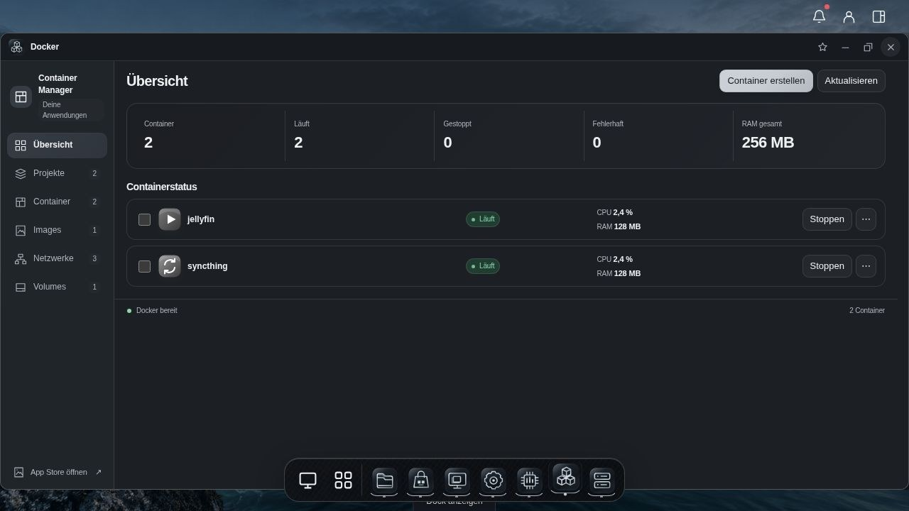

Die Docker-Ansicht zeigt Container, Compose-Gruppen, Images, Netzwerke und Volumes. CPU- und RAM-Messwerte werden getrennt vom Verbindungsstatus angezeigt. Die Übersicht nutzt kompakte Kennzahlen; Details öffnen sich nur bei Bedarf. Listen und Detailbereiche behalten ihre Scrollposition beim Wechsel.

Starten, Stoppen, Neustarten und weitere Aktionen verwenden den tatsächlichen Docker-Zustand. Fehler beim Laden oder bei Messwerten werden angezeigt. Spät eintreffende Logantworten können einen bereits geschlossenen oder gewechselten Detailbereich nicht wieder öffnen.

## Virtuelle Maschinen und Konsolen

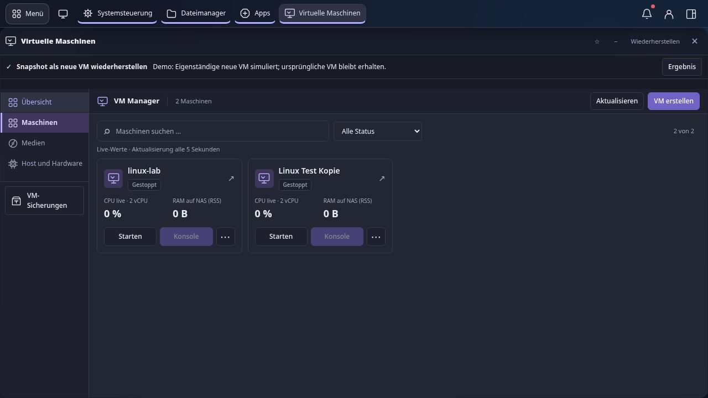

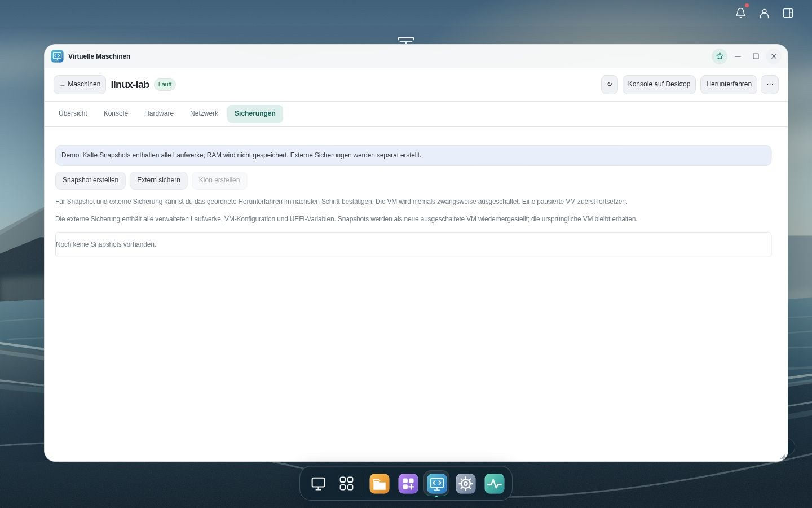

VM-Kacheln zeigen den frei wählbaren Namen sowie gemessene CPU- und RAM-Werte. **Großbuchstaben, Leerzeichen und Umlaute** sind in Anzeigenamen möglich; interne Libvirt- und Dateinamen bleiben davon getrennt. Ein Klick öffnet Konfiguration, Datenträger, Netzwerke, Konsole und Sicherungen. Regelmäßige Aktualisierungen erhalten die laufende Ansicht und eine bereits verbundene Konsole.

**Snapshots und Sicherungen** sind direkt in den VM-Details erreichbar. Bei laufenden VMs fordert Titan zunächst ein ausdrücklich bestätigtes, geordnetes Herunterfahren an. Snapshots sichern den Datenträgerzustand, keinen laufenden RAM-Zustand. Ein vollständiger Snapshot kann **als neue, ausgeschaltete VM** wiederhergestellt werden: mit eigener UUID, MAC-Adresse und unabhängigen Datenträgern. Die ursprüngliche VM bleibt erhalten. Unvollständige Snapshots werden nicht zur Wiederherstellung angeboten.

Das **Titan-Terminal** und die **VM-Konsole** besitzen kompakte Werkzeugleisten, passende Dunkel-/Hellflächen und Schnellaktionen. Das Terminal bietet Kopieren, Einfügen, Alles markieren, Bildschirm leeren und Befehl abbrechen; die VM-Konsole zusätzlich Gast-Tastenkombinationen, Skalierung, Vollbild und eine Textzwischenablage. Gemeinsames Kopieren und Einfügen mit dem Gast benötigt Unterstützung im Gastsystem. Browser können den direkten Zwischenablagezugriff beschränken; dafür steht ein Textdialog bereit. Terminal und einzelne VM-Konsolen können als Desktop-Verknüpfung abgelegt werden.

[VMs, Snapshots und Grenzen](docs/PACKAGES-AND-VMS.md) · [App-Sicherungen](docs/BACKUPS.md)

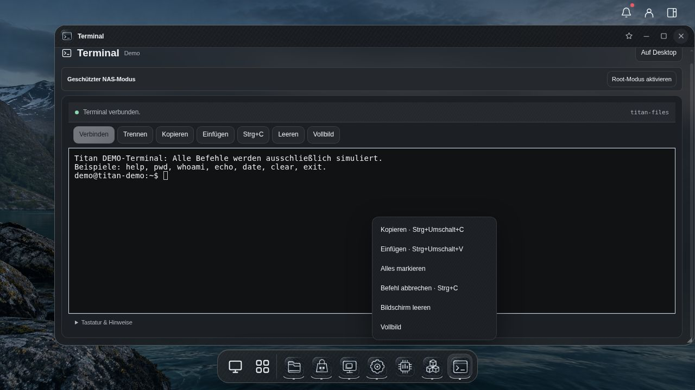

## Speicher, RAID und Sicherungen

Unter **Speicher → Speicherbereiche → Pool auswählen → RAID-Zustand / Reparatur** zeigt Titan Mitglieder, Fehlerzähler und Wiederaufbaustatus eines ZFS-Pools. Für einfache verwaltete **Mirror-, RAIDZ1- und RAIDZ2-Verbünde** mit ausreichender Restredundanz kann ein ausgefallenes Mitglied durch eine geprüfte leere Platte ersetzt werden. Titan prüft unter anderem Größe, eindeutige Laufwerksidentität, Belegung und SMART-Zustand und verlangt die ausdrückliche Bestätigung von Poolname und Ersatzplatte. Ein geänderter Zustand sperrt eine veraltete Bestätigung. Der Dialog zeigt den von ZFS gemeldeten Resilverfortschritt; der Auftragsstart allein gilt noch nicht als abgeschlossene Wiederherstellung.

RAID0, einzelne Ext4-/XFS-Platten, nicht mehr zugängliche Pools und komplexe ZFS-Topologien erhalten keinen automatischen Wiederaufbau. RAID und Snapshots ersetzen keine unabhängige Sicherung. [Ablauf, Voraussetzungen und Grenzen](docs/RAID-RECOVERY.md) erklären den geführten Laufwerkstausch. Dieser wurde automatisiert und in einer isolierten Demo geprüft; ein echter Plattenausfall und Wiederaufbau auf Testhardware sind noch nachzuweisen.

Der tägliche oder wöchentliche Sicherungsplan erhält eine Warnung, wenn nach dem fälligen Termin und zwei Stunden Kulanz keine passende verifizierte Sicherung vorliegt. Teil- und reine VM-Sicherungen erfüllen einen umfassenderen Plan nicht. Ein laufender Kopiervorgang löst keine solche Warnung aus. Die bestehende optionale E-Mail-Zustellung kann die Meldung versenden. Das Laufwerksmonitoring meldet zusätzlich explizite Fehler des letzten ATA-/NVMe-Selbsttests, auch wenn der SMART-Gesamtzustand noch positiv ist.

Die [NAS-Funktionsprüfung](docs/NAS-FUNCTION-AUDIT.md) hält vorhandene Funktionen und offene Lücken fest. Besonders wichtig bleiben der geführte Wiederanlauf nach Verlust der Systemplatte, USV-Einbindung, verschlüsselte inkrementelle Sicherungen und wiederkehrende VM-Sicherungen. Diese Funktionen sind noch nicht vollständig umgesetzt.

## Anmeldung, Verwaltung und Updates


Die Anmeldung unterstützt Passwort, optionalen zweiten Faktor und Anmeldeschutz. Das neue kompakte Layout passt auf große und kleine Bildschirme. Konten, Gruppen und Freigaberechte bleiben zentral verwaltbar.

**Bei jeder erfolgreichen Administrator-Anmeldung prüft Titan im Hintergrund auf Updates.** Ein verfügbares Update erscheint als Benachrichtigung und markiert die Glocke; diese öffnet direkt den Updatebereich. Normale Benutzer und eingebettete Appfenster starten diese Prüfung nicht. Unter **Updates & Rollback** können Administratoren nach Updates suchen, das signierte RAUC-Paket installieren und anschließend den Neustart bestätigen.

Titan verwendet zwei Systembereiche. Ein Update schreibt den inaktiven Bereich; ein bestätigter vorheriger Systemstand kann wieder ausgewählt werden. **Ein System-Rollback setzt gemeinsam genutzte App-Daten und Datenbanken nicht zurück.** Unabhängige Sicherungen und eine praktisch geprüfte Wiederherstellung bleiben erforderlich. Eine App-Wiederherstellung benötigt ein gestopptes, weiterhin passendes installiertes Paket und lässt die App anschließend gestoppt.

Die Einstellungen zeigt links Geräteinformationen und Live-Ressourcen, rechts durchsuchbare Einstellungsgruppen. Einzelne Bereiche öffnen mit ihrer passenden Navigation; Favoriten und Ansicht bleiben persönlich gespeichert.

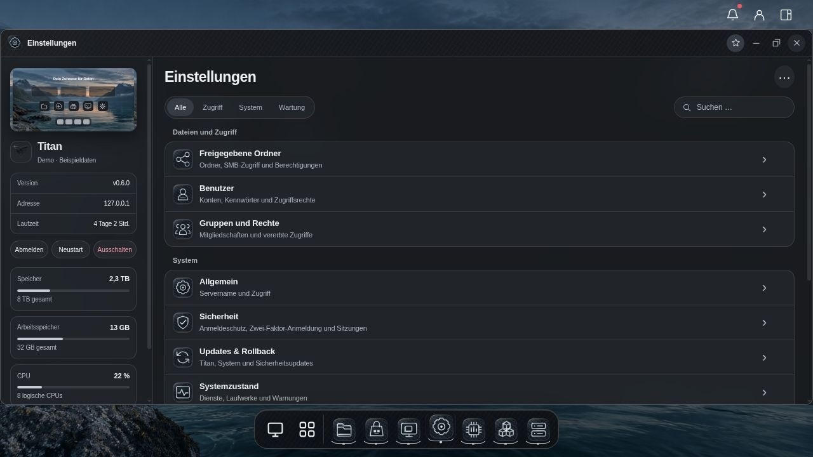

Weitere Bereiche umfassen Ext4/XFS/ZFS-Speicher, Laufwerksstatus, Dienste, Freigaben und Systemressourcen. Destruktive Aktionen und Änderungen an Netzwerk oder Systemschutz bleiben ausdrücklich bestätigungspflichtig.

## Entwicklung und Prüfung

```sh
python3 -m pip install PyYAML
python3 -m unittest discover -s tests
python3 -m titan.server --demo --host 127.0.0.1 --port 5089
```

Die Demo ist eine Vorschau mit simulierten Hostfunktionen. Sie ersetzt keine Prüfung auf echter Hardware oder mit echten Cloudflare-/Tailscale-Konten. Der [Release-Workflow für 0.6.1](https://github.com/ra5on/Titan/actions/runs/37943811929) ist erfolgreich abgeschlossen; Installationsimage, signiertes Update und Prüfberichte sind [veröffentlicht](https://github.com/ra5on/Titan/releases/tag/v0.6.1). Der [Prüfnachweis](docs/VERIFY-0.6.1.md) dokumentiert Quellstände, Containerprüfung, QEMU-Laufzeit- und A/B-Tests sowie verifizierte Signaturen und Dateiprüfsummen.

Für dieses Installationsimage verwendet die A/B-Prüfung eine private, als Altstand markierte Kopie des aktuellen Builds. Sie prüft Systemwechsel, Datenerhalt, Rollback und Fehlerwiederherstellung. Ein Upgrade von einem tatsächlich älteren veröffentlichten Titan-Image ist damit nicht vollständig nachgewiesen und muss separat geprüft werden.

[Entwicklung und Testgrenzen](docs/DEVELOPMENT.md) · [Bedienung und Layout](docs/UI-DESIGN.md) · [Updates](docs/UPDATES.md)

TitanOS dient ausschließlich als visuelle Orientierung. Titan verwendet eigenen Oberflächencode und eigene Gestaltung; Code und Assets von TitanOS wurden nicht übernommen.

## Lizenz

Der eigene Titan-Code ist für nichtkommerzielle Nutzung, Änderungen und kostenlose Weitergabe freigegeben. Der Rechteinhaber kann für sein eigenes Material gesonderte kommerzielle Rechte erteilen. Das hält den späteren Verkauf von Titan offen; fremde Komponenten und Beiträge benötigen ihre jeweiligen Rechte. Drittkomponenten behalten ihre jeweiligen Lizenzen. [Lizenz](LICENSE) · [Kommerzielle Zukunft und Herkunft](docs/LICENSING.md)

Neue Debian-Systemreleases enthalten neben dem Image auch versionsgenaue Debian-Quellarchive mit Index und signierten Prüfsummen. [Quellarchive prüfen und entpacken](docs/DEBIAN-SOURCES.md). Optionale Appcontainer und nachgeladene ML-Modelle haben eigene Lizenzbedingungen; insbesondere ist Immichs standardmäßiges Gesichtserkennungsmodell vor einem kommerziellen Angebot gesondert zu klären.
