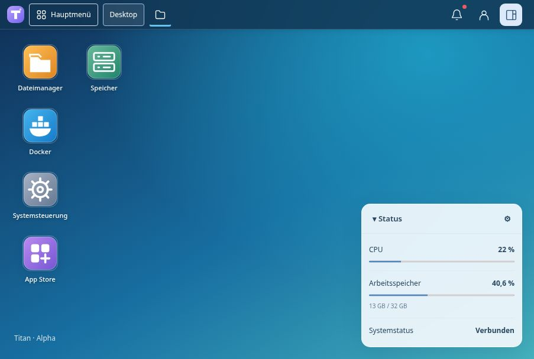

# Titan

**Dein NAS. Deine Dateien. Deine Anwendungen.**

Titan ist eine eigenständige NAS-Oberfläche auf Debian mit persönlichem Desktop, Dateimanager, Freigaben, virtuellen Maschinen und Docker-Verwaltung.

**Version: 0.5.3-alpha.1 · Alpha.** Zunächst mit Testdaten verwenden.

[**Image herunterladen · AMD64 (.img.xz)**](https://github.com/ra5on/Titan/releases/download/v0.5.3-alpha.1/titan-0.5.3-alpha.1-amd64.img.xz) · [Release, Checksummen und Prüfberichte](https://github.com/ra5on/Titan/releases/tag/v0.5.3-alpha.1)

Für den VM-Test: **UEFI/OVMF**, **Secure Boot aus**, **8 GiB RAM** und mindestens **64 GiB Festplatte**. Die `.img.xz` entpacken; das enthaltene Image ist 48 GiB groß. Die virtuelle Festplatte vor dem ersten Start auf die gewünschte Größe erweitern. Danach Titan unter `https://NAS-IP:5000` öffnen.

## Docker mit BigBear

Unter **App Store → BigBear-Katalog** lassen sich unterstützte Docker-Compose-Vorlagen laden. Vor der Installation wählst du Speicherbereich, Ports, Zugangsdaten und gegebenenfalls Netzwerk sowie Geräte aus. Datenbanken und Zusatzdienste werden als zusammengehöriger Stack eingerichtet.

- Anwendungen und einzelne Dienste starten, stoppen und neu starten.
- Status, Abhängigkeiten, Protokolle und Einstellungen an einem Ort ansehen.
- Installierte Vorlagen dauerhaft speichern; ein Katalog-Refresh verändert keine laufenden Stacks.
- Beim Deinstallieren Konfiguration, Datenbanken und Nutzdaten erhalten.
- Nicht unterstützte Vorlagen mit konkretem Grund anzeigen.

BigBear-Vorlagen werden bei Bedarf vom Herausgeber abgerufen und nicht mit Titan ausgeliefert. Die Importprüfung ersetzt keine Betriebsprüfung jeder einzelnen Anwendung. Nutzungsbedingungen der Vorlagen, Bilder und Anwendungen gelten unabhängig von Titan.

## Weitere Funktionen

| Bereich | Funktionen |
| --- | --- |
| Desktop | Fenster, Verknüpfungen, persönliche Anordnung, mobile Ansicht |
| Dateien | Vorschau, Texteditor, Ordner, Kopieren, Verschieben, Papierkorb |
| Speicher | Ext4, XFS und ZFS, Speicherbereiche und Laufwerksstatus |
| Benutzer | Konten, Gruppen, Freigaberechte und Anmeldeschutz |
| Virtuelle Maschinen | KVM/libvirt, BIOS/UEFI, Netzwerke und Browserkonsole |
| System | Ressourcen, Dienste, Sicherungen und signierte Updates mit Rollback |

[Docker und Katalog](docs/APP-STORES.md) · [Entwicklung](docs/DEVELOPMENT.md) · [Lizenz](LICENSE)

Der eigene Titan-Code ist für nichtkommerzielle Nutzung, Änderungen und kostenlose Weitergabe freigegeben. Kommerzielle Rechte können vom Rechteinhaber gesondert erteilt werden. Drittkomponenten behalten ihre jeweiligen Lizenzen.
