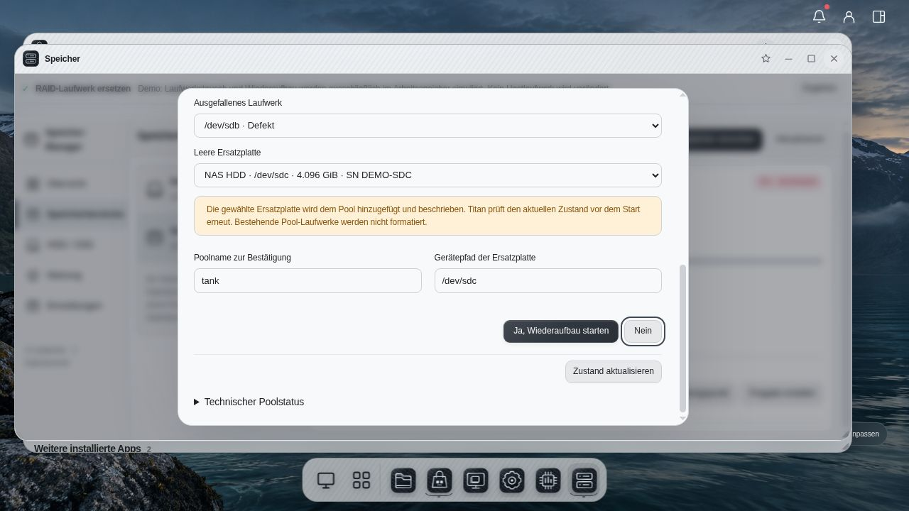
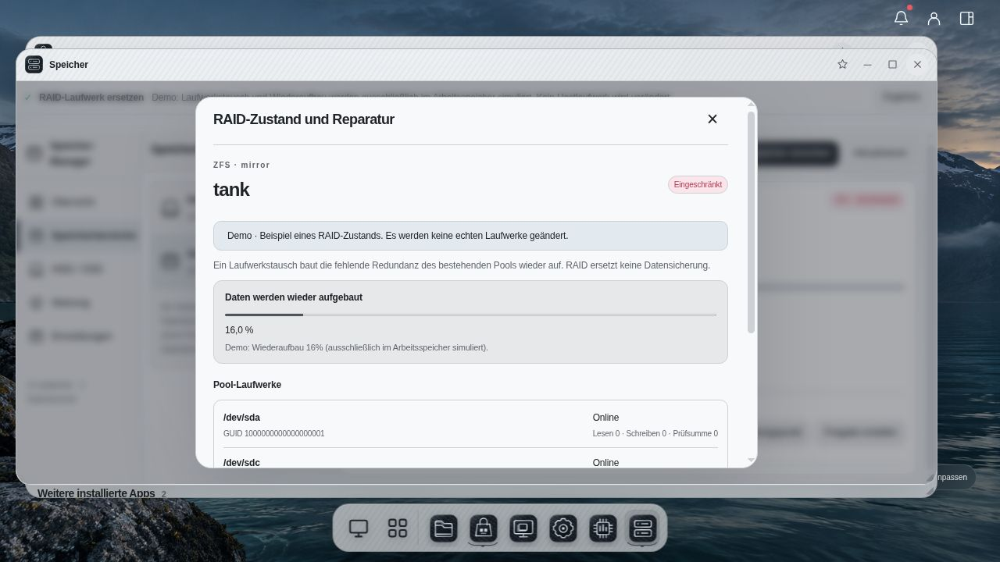

# ZFS-Laufwerkstausch und Wiederaufbau

Titan bietet unter **Speicher → Speicherbereiche → Pool auswählen → RAID-Zustand / Reparatur** einen geführten Austausch ausgefallener ZFS-Mitglieder. Dies gilt für von Titan verwaltete Pools mit einem einfachen Mirror-, RAIDZ1- oder RAIDZ2-Datenverbund und ausreichender verbleibender Redundanz.

## Ablauf in der Oberfläche

1. Den aktuellen Poolzustand laden. Titan zeigt Aufbau, Mitgliedslaufwerke, Fehlerzähler und einen laufenden Prüflauf oder Wiederaufbau.
2. **Ersatzplatten prüfen** öffnen. Geeignete und ausgeschlossene Platten werden mit Modell, Seriennummer, Gerätepfad, Größe und Ausschlussgrund aufgeführt.
3. Ein erkanntes ausgefallenes Mitglied und eine geeignete leere Ersatzplatte auswählen. Gesunde Mitglieder stehen nicht zum Austausch bereit.
4. Poolname und Gerätepfad der Ersatzplatte genau eingeben. **Ja, Wiederaufbau starten** steht links, **Nein** rechts.
5. Titan prüft Pool und Laufwerksidentität vor der Aktion erneut. Bei geändertem Zustand wird der Start abgewiesen; die Vorschau muss aktualisiert und erneut bestätigt werden.
6. Nach Annahme durch ZFS zeigt der Dialog den tatsächlichen Resilverstatus und gemeldeten Fortschritt. Ein angenommener Auftrag bestätigt ausschließlich den Start. Der Poolzustand und der abgeschlossene ZFS-Status müssen anschließend geprüft werden.

Der Status lässt sich erneut öffnen und manuell aktualisieren. Während eines aktiven Wiederaufbaus wird er alle fünf Sekunden abgefragt. Schließen des Fensters stoppt die Anzeige, nicht den durch ZFS verwalteten Wiederaufbau.

## Schutz vor falschen Laufwerken

Ersatzplatten benötigen eine eindeutige Seriennummer, einen dauerhaften Hardwarepfad unter `/dev/disk/by-id`, bestätigten SMART-Gesamtzustand und keinen explizit fehlgeschlagenen letzten Selbsttest. Fehlende oder widersprüchliche Hardwareinformationen sperren den automatischen Austausch. Das betrifft auch virtuelle Laufwerke und Controller, die SMART oder Seriennummern nicht durchreichen.

Titan lehnt eingehängte, schreibgeschützte, partitionierte oder belegte Platten sowie vorhandene Dateisystem-/RAID-Signaturen, Swap und aktive Geräteabhängigkeiten ab. Poolmitglieder und das laufende System werden nicht als leere Ersatzplatten behandelt. Die Ersatzplatte muss mindestens so groß wie die kleinste verbliebene Mitgliedsplatte sein; ZFS prüft zusätzlich die tatsächlich nutzbare Kapazität.

Die Aktion erfordert Administratorrechte und CSRF-Schutz; die Berechtigung wird auch bei Auftragsausführung erneut geprüft. Die Vorschau bindet die aktuell gelesene Pool-GUID, Mitglieds-GUIDs, Topologie und Ersatzplattenidentität. Neue Pools speichern ihre tatsächliche GUID dauerhaft; Abweichungen sperren die Reparatur. Ältere Pooldatensätze ohne gespeicherte GUID bleiben anhand ihres bisherigen Namens und Titan-Speicherorts kompatibel. Damit ist keine historische GUID-Identität dieser Altbestände nachgewiesen.

## Grenzen

Für RAID0, Ext4-/XFS-Einzelplatten, nicht mehr zugängliche Pools, unzureichende Restredundanz und komplexe Topologien mit mehreren Daten-vdevs, Zusatzgeräten oder verschachtelten Austausch-/Spare-Strukturen gibt es keinen automatischen Wiederaufbau. Hier zeigt Titan den Grund und verweist bei fehlender Wiederherstellbarkeit auf eine unabhängige Sicherung. ZFS-Snapshots innerhalb desselben Pools ersetzen diese Sicherung nicht.

Es werden keine Force-, Import-, Detach-, Labelclear- oder Formatieraktionen zur Umgehung der Prüfungen angeboten. Der produktive Pfad übergibt ausschließlich den bestätigten Austausch an `zpool replace`. Die letzte Hardwarepfadprüfung und das anschließende Öffnen durch die ZFS-CLI sind nicht atomar gegen einen gleichzeitigen physischen Gerätetausch gebunden.

Die [OpenZFS-Dokumentation zu zpool replace](https://openzfs.github.io/openzfs-docs/man/master/8/zpool-replace.8.html) beschreibt Größenregel und Resilververhalten. Titan bleibt Alpha: automatisierte Prüfungen und die reine RAM-Demo bestätigen keine Wiederherstellung nach einem echten Plattenausfall, keine Controllerkompatibilität und kein Neustart-/Hotplug-Verhalten. Diese Abläufe müssen auf Testhardware nachgewiesen werden.
